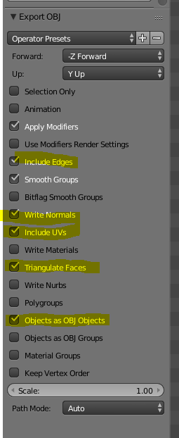

# Weave Engine

Weave Engine is a game engine that utilizes Boost ASIO to create a cross
platform server authoritative network stack written in C++. The engine 
aims to provide an interface for you to build a game on including Lua
script bindings, an asset importing pipeline, and an etensible entity
component system. 

The capabilities of the engine are demonstrated in a Tank shooter game,
where players can fire upon their enemies. 

This engine aims to accomplish the following:

* Server authoritative network architecture with a headless server
* LLVM/Clang compatibility
* Basic gameplay demo that showcases the networking features of the engine
* As cross platform as possible (input, graphics, filesystem, etc.)

## Getting Started

What do you need?

* Visual Studio 2017 with the C++ compiler options  
* [Clang](http://releases.llvm.org/download.html) 7.0.1 or newer __*__
* [Clang for Visual Studio](https://marketplace.visualstudio.com/items?itemName=LLVMExtensions.llvm-toolchain) __*__
* [Boost](https://www.boost.org/doc/libs/1_69_0/more/getting_started/windows.html)

__*__ _is an optional item that you can configure yourself_


1. Download the most up to date release build from the `master` branch:
 * [https://github.com/BenjaFriend/Weave_Engine/tree/master]
2. Initalize the submodules
 *  Run `git submodule update --init --recursive` at the root directory
3. Install Boost
 * Download the latest release at [https://www.boost.org/users/download/]
 * Unzip to your desired location
 * From PowerShell or command line run `bootstrap.bat`
 * Run `./b2 --with-system --with-thread --with-date_time --with-regex --with-serialization --with-filesystem stage`
 * This will take some time
4. Set Enviornment variables
 * Set `BOOST_ROOT` to your Boost root location (i.e. `C:/dev/boost_1_69_0`)
 * Set `BOOST_LIBRARYDIR` to your compiled Boost library 
   location (i.e. `C:/dev/boost_1_69_0/stage/lib`)

---
### Starter Code

I was provided some starter code in `Found. of Game Graphics Programming (IGME 540), Fall 2018` at RIT with Professor Chris Cascioli. We were given a "core" DirectX 11 framework to build upon throughout the semester.

The starter code included initial versions of:
* `DXCore` class
* `Game` class
* `Main.cpp`
* `SimpleShader` class
* `PixelShader.hlsl` and `VertexShader.hlsl`

>
> The goal of this course is to explore the use of an advanced graphics API to access hadrd-ware accelerated graphics in a real-time graphics engine context.
>

_Chris Cascioli, Course Syllabus_

All of these items have since been heavily modified, but it is worth 
noting for the begining architectural decisions that had to be made. 

The reason that I am using this core framework for this project is 
because the focus is not on graphics, and it provided a good starting 
point to go off of.  

---


## Creating art assets

If you want to create models, textures, or other art assets for the Weave Engine there are a couple of things you should be aware of.

### Assets folder
The assets of the engine are all available to the engine through the `Assets` folder. In code, you can access the `Assets` folder with a relative path, as the folder is copied to the output directory with every change to it. **Note** Depending on how xcopy decides to behave, this can get a little finicky when making changes to existing files.

### Material files
The Weave Engine has a material file format to help you when creating PBR materials called `wmat`. It is a simple JSON file format, making it easy to edit and more readable for none-programmers. The format is as follows:

```
{
	"MaterialName" : "Cobblestone_Mat",
    "VS" : "VertexShader.cso",
	"PS" : "PixelShader.cso",
	"albedo" : "Assets/Textures/cobblestone_albedo.png",
	"norm" : "Assets/Textures/cobblestone_normals.png",
	"roughness" : "Assets/Textures/cobblestone_roughness.png",
	"metal" : "Assets/Textures/cobblestone_metal.png"
}
```
In this example a material with the name `Cobblestone_Mat` will be created using the given arguments.

### 3D models
When creating 3D models, there are a couple of things to take into consideration. First, while the engine does use [Assimp](http://assimp.sourceforge.net/lib_html/usage.html) for loading in models, the implementation is a bit limited as it was not really the main focus of the project. Hopefully we can make some post-production improvements to this feature of the engine.

I would recommend using [Blender](https://www.blender.org/) for modeling and exporting to `.obj` files. Make sure that you calculate your normals and UV unwrap the model, otherwise it will just be black! Furthermore, I would recommend the following blender export settings:




## Branches

`master` is where we cut our releases
`staging` is what devs merge their feature branches into
